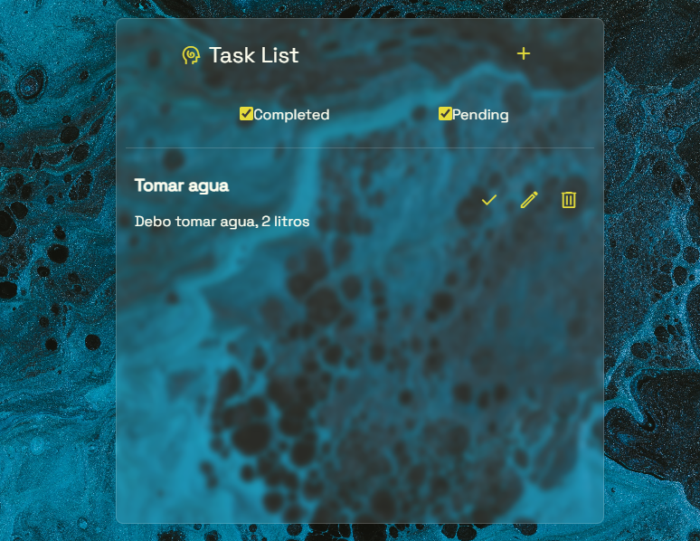
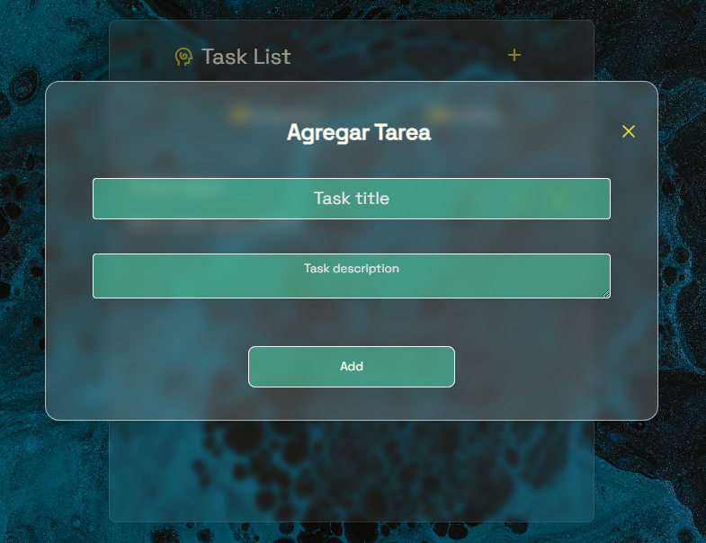

# Tablero de Tareas Interactivo

Este proyecto es un tablero de tareas interactivo desarrollado utilizando HTML, CSS y JavaScript. Proporciona a los usuarios la capacidad de agregar, editar, eliminar y marcar tareas como completadas. El tablero incluye una interfaz de usuario limpia y moderna, así como opciones de filtrado para mostrar tareas completadas y pendientes por separado.

## Características

- Agregar nuevas tareas con un título y una descripción.
- Marcar tareas como completadas o no completadas.
- Editar tareas existentes (título y descripción).
- Eliminar tareas de la lista.
- Filtrar tareas por estado (completadas o pendientes).

## Uso

1. Clona este repositorio o descarga los archivos.
2. Abre el archivo `index.html` en tu navegador web.

## Capturas de Pantalla

## Tecnologías Utilizadas

- HTML
- CSS
- JavaScript

## Autor

Tomás Maldocena

## Licencia

Este proyecto está bajo la Licencia Tomás Maldocena.